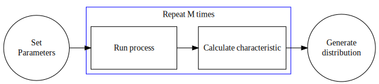
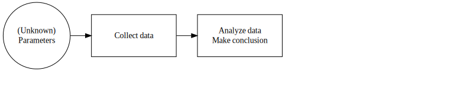
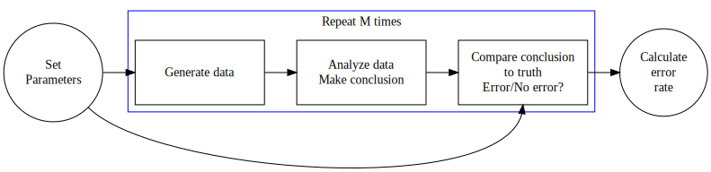
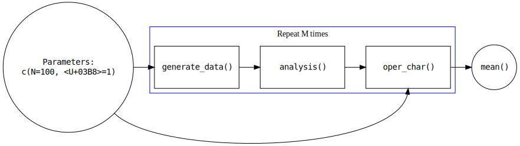

<style>
b, strong{
color: #25679E;
}

.popup {
    position: fixed;
    top: 50%;
    left: 50%;
    -webkit-transform: translate(-50%, -50%);
    transform: translate(-50%, -50%);
    padding: 1em;
    background-color: #abcabc;
    color: black;
    font-weight: bold;
    font-size: 30pt;
}
</style>


```{r setup, include=FALSE}
knitr::opts_chunk$set(echo = TRUE)
require(DiagrammeR)
require(DiagrammeRsvg)
require(knitr)
require(htmltools)
```

## Monte Carlo Simulation

**Monte Carlo Simulation** is repeated execution of a procedure --- usually by computer --- in order to understand the characteristics of the procedure.

## Example

What is the probability that at least one birthday is shared in a class of 30 individuals?

## Example

What is the probability that at least one birthday is shared in a class of 30 individuals?

<div class="popup">
Simulation generates approximate answers because we make simplifications!<br><br>
For example, we generally do not account for power outages and superbowl wins.<br><br>
Hopefully the error due to simplification is small.
</div>

## Code (will revisit)

```{r, eval = FALSE}
generate_class <- function(class_size){
  birthdays <- sample(1:366, class_size, replace = TRUE, prob = c(rep(1,365), .25))
  data.frame(student_id = 1:class_size, birthday = birthdays)
}

check_birthday <- function(class){
  class_summary <- class %>% 
    summarize(n = n(), n_bday = n_distinct(birthday)) %>% 
    mutate(shared = n > n_bday)
  class_summary[["shared"]]
}

replicates <- replicate(10000, 30 %>% generate_class %>% check_birthday)
mean(replicates)
```

## Code (will revisit)

```{r, eval = FALSE}
generate_class <- function(class_size){
  birthdays <- sample(1:366, class_size, replace = TRUE, prob = c(rep(1,365), .25))
  data.frame(student_id = 1:class_size, birthday = birthdays)
}

check_birthday <- function(class){
  class_summary <- class %>% 
    summarize(n = n(), n_bday = n_distinct(birthday)) %>% 
    mutate(shared = n > n_bday)
  class_summary[["shared"]]
}

replicates <- replicate(10000, 30 %>% generate_class %>% check_birthday)
mean(replicates)
```

<div class="popup">
Code not important on the first day.
</div>

## Example

What is the distribution of the largest **run** in a sequence of 100 flips of a fair coin?


## Example

What is the distribution of the largest **run** in a sequence of 100 flips of a fair coin?

<div class="popup">
Simulation generates approximate answers even when there are no simplifications!<br><br>
The number of replicates is finite.
</div>


## Operating characteristic

Key properties of a procedure are often called **operating characteristics**.  Generally, one wants to know the **distribution** of an operating characteristic over repeated executions of the study.

## Operating characteristic

Key properties of a procedure are often called **operating characteristics**.  Generally, one wants to know the **distribution** of an operating characteristic over repeated executions of the study.

<div class="popup">
There are lots of everyday operating characteristics.<br><br>
Stop thinking like a data scientist and think about items you use each day.<br><br>
What are operating characteristics related to your car, cell phone, air conditioning?
</div>


## Operating characteristic

Operating characteristics are the currency by which we evaluate and compare data science procedures.

## Examples/Questions

1. A data scientist claims to have developed a tool to identify college freshman that are highly likely to join the armed forces.  What operating characteristics would you like to know about the tool?

1. A data scientist develops an algorithm for estimating the probability that a credit card transaction is fraudulent or not.  What operating characteristics are important?

Operating characteristics are premised on the classic "long-run" interpretation of probabilistic events. As such, they can be simulated by simply repeating the planned procedure and observing how often some event happens.

## Examples/Questions

1. A data scientist claims to have developed a tool to identify college freshman that are highly likely to join the armed forces.  What operating characteristics would you like to know about the tool?

1. A data scientist develops an algorithm for estimating the probability that a credit card transaction is fraudulent or not.  What operating characteristics are important?

Operating characteristics are premised on the classic "long-run" interpretation of probabilistic events. As such, they can be simulated by simply repeating the planned procedure and observing how often some event happens.

<div class="popup">
DOES IT WORK?
</div>

## tgs axioms of computing

So you want to perform a simulation study? Start with the tgs axioms of computing:

### Axiom 1. 

**The act of turning on the computer does not magically endow you with understanding of your task.**  If you do not know how you will perform an analysis or simulation before you turn on your computer, you will not know how to do it afterwards either.

## tgs axioms of computing

### Axiom 2. 

**Use modular/functional programming.**  Functional programming means that you identify and write short, single purpose functions for each distinct task in your program.  (Examples below.)  This will allow you to develop your code in a systematic way, and it will provide a natural method for debugging your code.  You will simply need to verify that the different sub-functions are working as expected.

## The big picture of simulation studies for stochastic processes

In a setting where one is trying to understand a **random process**, identify the **input parameters** and the **desired characteristic**.

## The big picture of simulation studies for stochastic processes

```{r, fig.height = 3, echo = FALSE, results='asis'}
b2 <- grViz("
digraph boxes_and_circles {

graph [rankdir = LR]
edge [ constraint=false ];

node [shape = circle, label = 'Set\nParameters'] A

subgraph cluster2 {
  label = 'Repeat M times';
  rankdir = LR;
  node [shape = box, label = 'Run process', width = 2, height = 1] B;
  node [shape = box, label = 'Calculate characteristic', width = 2] C;
  B -> C [constraint = true];
  color = blue;
}

node [shape = circle, label = 'Generate\ndistribution'] E;

// cluster external horizontal order
  A -> B [constraint=true];
  C -> E [constraint=true];
}
")
b2 %>% export_svg %>% HTML %>% cat(file = "./assets/b2.svg")
```

{width=100%}

## The big picture of simulation studies for inference

In a typical data analysis setting, there are population parameters that one hopes to estimate by collecting and analyzing data.  The population parameters are unknown, and the accuracy of the conclusions is unknown.

## The big picture of simulation studies for inference

```{r, echo = FALSE}
a <- grViz("
digraph boxes_and_circles {

graph [rankdir = LR]
edge [ constraint=false ];

node [shape = circle, label = '(Unknown)\nParameters'] A

subgraph cluster2 {
  label = '';
  rankdir = LR;
  node [shape = box, label = 'Collect data', width = 2, height = 1] B;
  node [shape = box, label = 'Analyze data\n Make conclusion', width = 2] C;
  node [shape = box, label = 'Compare conclusion\nto truth\nError/No error?', style = invis, width = 2] D;
  B -> C [constraint = true];
  C -> D [constraint = true, style = invis];
  color = white;
}

node [shape = circle, label = 'Calculate\nerror\nrate', style = invis] E;

// cluster external horizontal order
  A -> B [constraint=true];
  D -> E [constraint=true, style = invis];

A -> D [tailport = se, headport = s, style = invis]
}
")
a %>% export_svg %>% HTML %>% cat(file = "./assets/a.svg")
```

{width=100%}


## The big picture of simulation studies for inference

```{r, fig.height = 3, echo = FALSE, results='asis'}
b <- grViz("
digraph boxes_and_circles {

graph [rankdir = LR]
edge [ constraint=false ];

node [shape = circle, label = 'Set\nParameters'] A

subgraph cluster2 {
  label = 'Repeat M times';
  rankdir = LR;
  node [shape = box, label = 'Generate data', width = 2, height = 1] B;
  node [shape = box, label = 'Analyze data\n Make conclusion', width = 2] C;
  node [shape = box, label = 'Compare conclusion\nto truth\nError/No error?', width = 2] D;
  B -> C [constraint = true];
  C -> D [constraint = true];
  color = blue;
}

node [shape = circle, label = 'Calculate\nerror\nrate'] E;

// cluster external horizontal order
  A -> B [constraint=true];
  D -> E [constraint=true];

A -> D [tailport = se, headport = s]
}
")
b %>% export_svg %>% HTML %>% cat(file = "./assets/b.svg")
```
{width=100%}

## The big picture of simulation studies for inference

In a simulation setting, the researcher sets the population parameters then generates data using the parameters. After completing the analysis, the researcher can then evaluate the accuracy of the conclusions. By repeating this process several times, the researcher can estimate the operating characteristics for **the specific set of population parameters used to simulate the data**. 

## Caveat emptor

Simulations are essentialy computational proofs on a case-by-case basis (e.g., this result happens for this parameter set, that result happens for that parameter set). It is up to you make the conneciton between different settings, notice patterns, and make a case for general patterns of behavior under certain circumstances. Simuations lack the natural generalizibiltiy of a mathematical proof, so the results don't necessary hold for all sets of parameter values.

## How to write a simulation studies

The framework described above suggests how one may write modular code to perform the simulation.  One can write a function to perform each of the primary tasks.  For example:

```{r, fig.height = 3, echo = FALSE, results='asis'}
c <- grViz("
digraph boxes_and_circles {

graph [rankdir = LR]
edge [ constraint=false ];

node [shape = circle, label = 'Parameters:\nc(N=100, θ=1)', fontname = 'monospace'] A

subgraph cluster2 {
  label = 'Repeat M times';
  rankdir = LR;
  node [shape = box, label = 'generate_data()', width = 2, height = 1, fontname = 'monospace'] B;
  node [shape = box, label = 'analysis()', width = 2] C;
  node [shape = box, label = 'oper_char()', width = 2] D;
  B -> C [constraint = true];
  C -> D [constraint = true];
  color = blue;
}

node [shape = circle, label = 'mean()', fontname = 'monospace'] E;

// cluster external horizontal order
  A -> B [constraint=true];
  D -> E [constraint=true];

A -> D [tailport = se, headport = s]
}
")
c %>% export_svg %>% HTML %>% cat(file = "./assets/c.svg")
```

## How to write a simulation studies

{width=100%}

